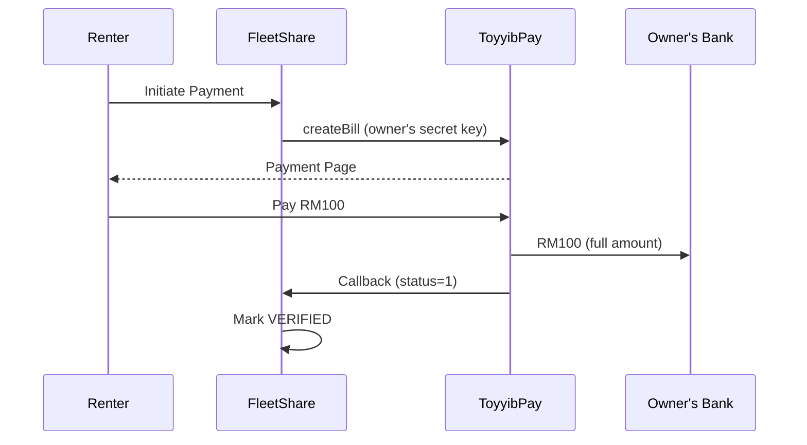
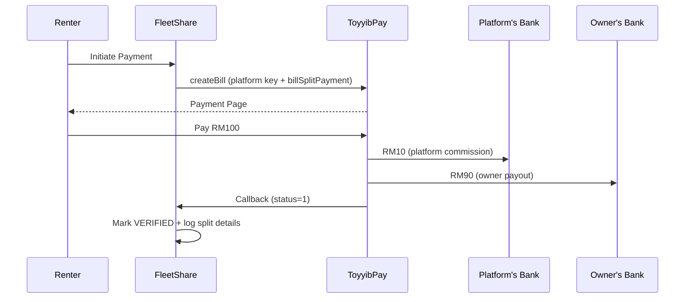

# FleetShare Central Payout Module — Viability Assessment & Implementation Guide

## 1. Executive Summary

This document assesses the viability and provides a comprehensive implementation plan for migrating FleetShare's payment flow from a **direct-to-owner** model (current BYOK) to a **platform-mediated central payout** model using ToyyibPay's **Split Payment** feature.

### Current State (BYOK — Direct to Owner)



> **Problem:** FleetShare receives **zero commission**. The entire amount goes directly to the owner's ToyyibPay account. The platform has no revenue path.

### Proposed State (Central Payout via Split Payment)



> **Result:** ToyyibPay natively splits the payment at the point of transaction. No manual transfers needed.

---

## 2. Viability Assessment

### 2.1 ToyyibPay API Confirmation

Based on the [official ToyyibPay API reference](https://toyyibpay.com/apireference), the [createBill](file:///c:/Users/NAIM/Documents/UMT/FYP/Project%20Repo/fleetshare/fleetshare/src/main/java/com/najmi/fleetshare/service/ToyyibPayService.java#46-152) endpoint supports two key parameters:

| Parameter | Type | Description |
|---|---|---|
| `billSplitPayment` | `0` or `1` | Set `1` to enable split payment to other toyyibPay users |
| `billSplitPaymentArgs` | JSON string | `[{"id":"username","amount":"200"}]` — [id](file:///c:/Users/NAIM/Documents/UMT/FYP/Project%20Repo/fleetshare/fleetshare/src/main/java/com/najmi/fleetshare/service/ToyyibPayService.java#153-180) is the toyyibPay **username** (not secret key), `amount` in cents |

> [!IMPORTANT]
> **Critical Limitation:** Split Payment is available for **Online Banking (FPX) only**, **NOT** for Credit Card payments. This means your `billPaymentChannel` must be set to `0` (FPX only) or `2` (both) BUT the split will only apply when the payer uses FPX.

> [!WARNING]
> **Gemini's response contained an inaccuracy.** The `billSplitPaymentArgs` uses the toyyibPay **username** ([id](file:///c:/Users/NAIM/Documents/UMT/FYP/Project%20Repo/fleetshare/fleetshare/src/main/java/com/najmi/fleetshare/service/ToyyibPayService.java#153-180) field), **not** the `userSecretKey`. This is a critical distinction—the owner needs to provide their **toyyibPay username**, not just their secret key.

### 2.2 Viability Verdict: ✅ VIABLE (with caveats)

| Criteria | Status | Notes |
|---|---|---|
| API Support | ✅ | Native `billSplitPayment` in [createBill](file:///c:/Users/NAIM/Documents/UMT/FYP/Project%20Repo/fleetshare/fleetshare/src/main/java/com/najmi/fleetshare/service/ToyyibPayService.java#46-152) |
| Sandbox Testing | ✅ | Fully testable on `dev.toyyibpay.com` |
| Architectural Fit | ✅ | Bill creation calls are centralized in [ToyyibPayService](file:///c:/Users/NAIM/Documents/UMT/FYP/Project%20Repo/fleetshare/fleetshare/src/main/java/com/najmi/fleetshare/service/ToyyibPayService.java#23-214) |
| Credential Change | ⚠️ | Bill must be created with **platform's** secret key, not owner's |
| Owner Identification | ⚠️ | Requires owner's **toyyibPay username**, not secret key |
| Payment Channel | ⚠️ | Split only works with FPX (not credit card) |
| Existing BYOK Impact | ⚠️ | Fundamental shift: bills are now created under **platform's** account |

---

## 3. Architecture Comparison

### 3.1 Current BYOK Architecture

```
Bills created UNDER owner's account
├── userSecretKey = owner.toyyibpaySecretKey
├── categoryCode  = owner.toyyibpayCategoryCode
├── billSplitPayment = 0
└── Result: 100% → Owner's bank
```

**Files involved:**
- [ToyyibPayService.java](file:///c:/Users/NAIM/Documents/UMT/FYP/Project%20Repo/fleetshare/fleetshare/src/main/java/com/najmi/fleetshare/service/ToyyibPayService.java) — Lines 79-81: Uses `owner.getToyyibpaySecretKey()` and `owner.getToyyibpayCategoryCode()`
- [ToyyibPayService.java](file:///c:/Users/NAIM/Documents/UMT/FYP/Project%20Repo/fleetshare/fleetshare/src/main/java/com/najmi/fleetshare/service/ToyyibPayService.java) — Lines 93-94: `billSplitPayment=0`, `billSplitPaymentArgs=""`

### 3.2 Proposed Central Payout Architecture

```
Bills created UNDER platform's account
├── userSecretKey = platform.secretKey (from config)
├── categoryCode  = platform.categoryCode (from config)
├── billSplitPayment = 1
├── billSplitPaymentArgs = [{"id":"ownerUsername","amount":"9000"}]
└── Result: Commission → Platform's bank, Remainder → Owner's bank
```

### 3.3 Key Architectural Shift

| Aspect | Current (BYOK) | Proposed (Central Payout) |
|---|---|---|
| Bill Creator | Owner's ToyyibPay account | **Platform's** ToyyibPay account |
| Owner Credential Used | `secretKey` + `categoryCode` | **`toyyibPayUsername`** only |
| Platform Credential | None needed | `secretKey` + `categoryCode` from **config** |
| Revenue Split | 100% to owner | Configurable commission % |
| Callback Hash Validation | Uses owner's secret key | Uses **platform's** secret key |
| Transaction Visibility | Owner sees in their dashboard | **Platform** sees all transactions |

---

## 4. Detailed Implementation Plan

### 4.1 Database Changes

#### A. `fleetowners` Table — New Column

```sql
ALTER TABLE fleetowners
ADD COLUMN toyyibpay_username VARCHAR(100) DEFAULT NULL
COMMENT 'Owner toyyibPay username for split payment routing';
```

> The existing `toyyibpay_secret_key` and `toyyibpay_category_code` columns can be **retained for backwards compatibility** or deprecated later.

#### B. `payments` Table — New Columns for Split Tracking

```sql
ALTER TABLE payments
ADD COLUMN platform_commission DECIMAL(10,2) DEFAULT NULL
    COMMENT 'Platform commission amount for this payment',
ADD COLUMN owner_payout DECIMAL(10,2) DEFAULT NULL
    COMMENT 'Amount routed to fleet owner for this payment',
ADD COLUMN commission_rate DECIMAL(5,4) DEFAULT NULL
    COMMENT 'Commission rate applied (e.g., 0.1000 = 10%)',
ADD COLUMN split_payment_enabled TINYINT(1) DEFAULT 0
    COMMENT '1 if split payment was used, 0 otherwise';
```

#### C. New `platform_config` Table (Optional — or use [application.properties](file:///c:/Users/NAIM/Documents/UMT/FYP/Project%20Repo/fleetshare/fleetshare/src/main/resources/application.properties))

For dynamic commission management via admin panel:

```sql
CREATE TABLE platform_config (
    config_key VARCHAR(100) PRIMARY KEY,
    config_value VARCHAR(500) NOT NULL,
    description VARCHAR(255),
    updated_at DATETIME DEFAULT CURRENT_TIMESTAMP ON UPDATE CURRENT_TIMESTAMP
);

INSERT INTO platform_config (config_key, config_value, description) VALUES
('commission_rate', '0.10', 'Platform commission rate (10%)'),
('payout_mode', 'SPLIT', 'SPLIT = ToyyibPay split, MANUAL = manual transfer');
```

### 4.2 Entity Changes

#### [MODIFY] FleetOwner.java

Add `toyyibpayUsername` field:

```diff
 @Column(name = "toyyibpay_category_code", length = 100)
 private String toyyibpayCategoryCode;

+@Column(name = "toyyibpay_username", length = 100)
+private String toyyibpayUsername;

 // Constructors
```

Plus getter/setter.

#### [MODIFY] Payment.java

Add split payment tracking fields:

```diff
 @Column(name = "gateway_ref_no", length = 100)
 private String gatewayRefNo;

+@Column(name = "platform_commission", precision = 10, scale = 2)
+private BigDecimal platformCommission;
+
+@Column(name = "owner_payout", precision = 10, scale = 2)
+private BigDecimal ownerPayout;
+
+@Column(name = "commission_rate", precision = 5, scale = 4)
+private BigDecimal commissionRate;
+
+@Column(name = "split_payment_enabled")
+private Boolean splitPaymentEnabled = false;
```

Plus getters/setters.

### 4.3 Configuration Changes

#### [MODIFY] application.properties

```diff
 # ToyyibPay Gateway Configuration
 toyyibpay.api.base-url=https://dev.toyyibpay.com
 toyyibpay.bill.expiry-days=3
 toyyibpay.bill.payment-channel=2
+
+# Platform ToyyibPay Credentials (Central Payout)
+toyyibpay.platform.secret-key=${TOYYIBPAY_PLATFORM_SECRET_KEY:}
+toyyibpay.platform.category-code=${TOYYIBPAY_PLATFORM_CATEGORY_CODE:}
+toyyibpay.platform.username=${TOYYIBPAY_PLATFORM_USERNAME:}
+
+# Commission Configuration
+fleetshare.commission.rate=0.10
+fleetshare.commission.enabled=true
```

### 4.4 Service Changes

#### [MODIFY] ToyyibPayService.java — Core Change

The [createBill](file:///c:/Users/NAIM/Documents/UMT/FYP/Project%20Repo/fleetshare/fleetshare/src/main/java/com/najmi/fleetshare/service/ToyyibPayService.java#46-152) method signature and logic must change fundamentally:

```diff
-public String createBill(FleetOwner owner, Payment payment, BookingDTO booking,
-                         String renterEmail, String renterPhone, String renterName) {
+public String createBill(FleetOwner owner, Payment payment, BookingDTO booking,
+                         String renterEmail, String renterPhone, String renterName,
+                         BigDecimal platformCommission, BigDecimal ownerPayout) {
```

Key changes inside the method:

```diff
 // Build form data
 MultiValueMap<String, String> formData = new LinkedMultiValueMap<>();
-formData.add("userSecretKey", owner.getToyyibpaySecretKey());
-formData.add("categoryCode", owner.getToyyibpayCategoryCode());
+formData.add("userSecretKey", platformSecretKey);      // Platform's key
+formData.add("categoryCode", platformCategoryCode);    // Platform's category

 // ... other fields unchanged ...

-formData.add("billSplitPayment", "0");
-formData.add("billSplitPaymentArgs", "");
+// Enable split payment to route owner's share
+if (owner.getToyyibpayUsername() != null && !owner.getToyyibpayUsername().isEmpty()
+        && ownerPayout.compareTo(BigDecimal.ZERO) > 0) {
+    formData.add("billSplitPayment", "1");
+    int ownerPayoutCents = ownerPayout.multiply(BigDecimal.valueOf(100)).intValue();
+    String splitArgs = String.format(
+        "[{\"id\":\"%s\",\"amount\":\"%d\"}]",
+        owner.getToyyibpayUsername(), ownerPayoutCents);
+    formData.add("billSplitPaymentArgs", splitArgs);
+} else {
+    // Fallback: no split (full amount to platform)
+    formData.add("billSplitPayment", "0");
+    formData.add("billSplitPaymentArgs", "");
+}
```

#### [NEW] CommissionService.java

```java
@Service
public class CommissionService {

    @Value("${fleetshare.commission.rate:0.10}")
    private BigDecimal commissionRate;

    @Value("${fleetshare.commission.enabled:true}")
    private boolean commissionEnabled;

    /**
     * Calculates the platform commission and owner payout.
     *
     * @param totalAmount Total payment amount
     * @return Map with "commission", "ownerPayout", and "rate" keys
     */
    public Map<String, BigDecimal> calculateSplit(BigDecimal totalAmount) {
        Map<String, BigDecimal> result = new HashMap<>();

        if (!commissionEnabled) {
            result.put("commission", BigDecimal.ZERO);
            result.put("ownerPayout", totalAmount);
            result.put("rate", BigDecimal.ZERO);
            return result;
        }

        BigDecimal commission = totalAmount
            .multiply(commissionRate)
            .setScale(2, RoundingMode.HALF_UP);

        BigDecimal ownerPayout = totalAmount.subtract(commission);

        result.put("commission", commission);
        result.put("ownerPayout", ownerPayout);
        result.put("rate", commissionRate);
        return result;
    }
}
```

#### [MODIFY] ToyyibPayController.java — Callback Hash Validation

```diff
 // 3. Validate hash if provided
 if (hash != null && !hash.isEmpty()) {
-    boolean isValid = toyyibPayService.validateCallbackHash(
-            owner.getToyyibpaySecretKey(), status, orderId, refno, hash);
+    boolean isValid = toyyibPayService.validateCallbackHash(
+            platformSecretKey, status, orderId, refno, hash);  // Use platform key
```

#### [MODIFY] RenterController.java — Payment Initiation

The gateway payment flow in [processGatewayPayment](file:///c:/Users/NAIM/Documents/UMT/FYP/Project%20Repo/fleetshare/fleetshare/src/main/java/com/najmi/fleetshare/controller/RenterController.java#545-609) needs to:
1. Calculate commission split via `CommissionService`
2. Pass split amounts to `ToyyibPayService.createBill()`
3. Store split metadata on the [Payment](file:///c:/Users/NAIM/Documents/UMT/FYP/Project%20Repo/fleetshare/fleetshare/src/main/java/com/najmi/fleetshare/entity/Payment.java#7-150) entity

### 4.5 Owner Onboarding UI Changes

#### [MODIFY] owner/profile.html

Add a field for **ToyyibPay Username**:

```html
<div class="form-group">
    <label class="form-label">ToyyibPay Username</label>
    <input type="text" class="form-control" id="toyyibpayUsername"
           placeholder="Enter your ToyyibPay username"
           th:value="${owner != null ? owner.toyyibpayUsername : ''}">
    <small class="text-muted">
        Your toyyibPay username for receiving split payments.
        This is the username you use to log in at toyyibpay.com
    </small>
</div>
```

### 4.6 Admin Dashboard — Commission Reporting

#### [NEW] Admin Payout Dashboard View

A new admin page to show:
- Total platform revenue (sum of `platform_commission` for verified payments)
- Pending payouts vs. completed splits
- Per-owner payout history
- Commission rate configuration

---

## 5. Critical Considerations

### 5.1 FPX-Only Limitation

> [!CAUTION]
> ToyyibPay **only supports split payments via FPX (Online Banking)**. If a renter pays via **Credit Card**, the split will NOT apply and the **full amount goes to the platform account**. You must handle the owner payout manually for credit card transactions.

**Mitigation Options:**
1. **Restrict `billPaymentChannel` to `0` (FPX only)** when split payment is enabled
2. **Allow both channels** but detect credit card payments in the callback and flag them for manual payout
3. **Maintain dual mode:** Use split for FPX, and manual payout (or BYOK fallback) for credit card

### 5.2 Owner Account Verification

Before enabling split payment for an owner, verify:
- Owner has a registered toyyibPay account
- Owner's `toyyibpayUsername` is valid and matches a real toyyibPay user
- Consider adding a verification flow (e.g., create a RM0.01 test split bill)

### 5.3 Backwards Compatibility

Owners who haven't provided their `toyyibpayUsername` should **NOT** break the system. Two approaches:

1. **Fallback to BYOK:** If `toyyibpayUsername` is null but `toyyibpaySecretKey` exists, use the existing BYOK flow (no commission)
2. **Fallback to no-split:** Create the bill under the platform account without split (platform receives 100%, manual payout required)

### 5.4 Financial Reconciliation

With split payments, the platform needs:
- A `PaymentSplitLog` or enriched [PaymentStatusLog](file:///c:/Users/NAIM/Documents/UMT/FYP/Project%20Repo/fleetshare/fleetshare/src/main/java/com/najmi/fleetshare/service/PaymentService.java#84-87) to record the exact split amounts
- Monthly reconciliation reports
- Handling of refunds (if ToyyibPay supports them — currently limited)

### 5.5 Security

- **Platform credentials** (`toyyibpay.platform.secret-key`) must be stored securely (env vars, not in code)
- **Owner usernames** are lower-risk than secret keys but still PII
- **Callback validation** switches from owner's key to platform's key — ensure the migration is synchronized

---

## 6. Sandbox Testing Strategy

### 6.1 Account Setup

| Account | Purpose | Portal |
|---|---|---|
| **Account A** (Platform) | FleetShare platform account | `dev.toyyibpay.com` |
| **Account B** (Owner 1) | Test fleet owner | `dev.toyyibpay.com` |

Use email aliases: `yourname+platform@email.com`, `yourname+owner1@email.com`

### 6.2 Test Configuration

```properties
# .env (or application-dev.properties)
TOYYIBPAY_PLATFORM_SECRET_KEY=<Account A's secret key>
TOYYIBPAY_PLATFORM_CATEGORY_CODE=<Account A's category code>
TOYYIBPAY_PLATFORM_USERNAME=<Account A's username>
```

In the DB, set the test owner's `toyyibpay_username` to Account B's username.

### 6.3 Test Scenarios

| # | Scenario | Expected Result |
|---|---|---|
| 1 | FPX payment with split enabled | Platform gets commission, owner gets payout |
| 2 | Owner without `toyyibpayUsername` | Fallback to BYOK or no-split |
| 3 | Credit card payment with split | Full amount to platform (flag for manual payout) |
| 4 | Callback hash validation | Uses platform key, validates correctly |
| 5 | Different commission rates | Split amounts calculated correctly |
| 6 | RM0 commission (rate=0) | Full amount to owner, no split |

### 6.4 Verification Steps

1. Create a bill via the API → verify `billSplitPayment=1` in the request
2. Complete a simulated FPX payment on `dev.toyyibpay.com`
3. Check Account A's dashboard → verify commission received
4. Check Account B's dashboard → verify owner payout received
5. Check FleetShare DB → verify `platform_commission`, `owner_payout`, `split_payment_enabled` fields populated
6. Use ngrok to expose `localhost:8080` for callback testing

---

## 7. Implementation Phases

### Phase 1: Foundation (Database + Entities + Config)
- Add DB columns (`toyyibpay_username`, commission tracking)
- Update [FleetOwner.java](file:///c:/Users/NAIM/Documents/UMT/FYP/Project%20Repo/fleetshare/fleetshare/src/main/java/com/najmi/fleetshare/entity/FleetOwner.java), [Payment.java](file:///c:/Users/NAIM/Documents/UMT/FYP/Project%20Repo/fleetshare/fleetshare/src/main/java/com/najmi/fleetshare/entity/Payment.java) entities
- Add platform config to [application.properties](file:///c:/Users/NAIM/Documents/UMT/FYP/Project%20Repo/fleetshare/fleetshare/src/main/resources/application.properties)
- Create `CommissionService.java`

### Phase 2: Core Payment Flow
- Modify `ToyyibPayService.createBill()` to use platform key + split args
- Update `ToyyibPayController.handleCallback()` for platform key validation
- Update `RenterController.processGatewayPayment()` to calculate and pass split amounts
- Store commission/payout data on Payment entity

### Phase 3: Owner Onboarding
- Add `toyyibpayUsername` field to owner profile page
- Update owner profile save endpoint
- Add validation/help text for username input

### Phase 4: Admin Dashboard
- Commission reporting page
- Per-owner payout history
- Commission rate configuration UI

### Phase 5: Testing & Rollout
- Sandbox testing with 2 dev accounts
- Edge case testing (no username, credit card, rate changes)
- Production deployment with ngrok testing → real domain

---

## 8. Risk Matrix

| Risk | Severity | Mitigation |
|---|---|---|
| Split only works for FPX | **High** | Restrict to FPX or implement manual payout for card |
| Owner provides wrong username | **Medium** | Add username validation via test transaction |
| Platform key compromise | **High** | Use env vars, rotate keys, restrict IP access |
| Commission disputes | **Medium** | Transparent commission display on invoices/receipts |
| ToyyibPay API changes | **Low** | Monitor API docs, abstract API calls behind service layer |
| Refund handling | **Medium** | Define refund policy (manual vs. API, who bears the refund) |

---

## 9. Files Affected Summary

| File | Change Type | Description |
|---|---|---|
| [FleetOwner.java](file:///c:/Users/NAIM/Documents/UMT/FYP/Project%20Repo/fleetshare/fleetshare/src/main/java/com/najmi/fleetshare/entity/FleetOwner.java) | MODIFY | Add `toyyibpayUsername` field |
| [Payment.java](file:///c:/Users/NAIM/Documents/UMT/FYP/Project%20Repo/fleetshare/fleetshare/src/main/java/com/najmi/fleetshare/entity/Payment.java) | MODIFY | Add commission tracking fields |
| [ToyyibPayService.java](file:///c:/Users/NAIM/Documents/UMT/FYP/Project%20Repo/fleetshare/fleetshare/src/main/java/com/najmi/fleetshare/service/ToyyibPayService.java) | MODIFY | Switch to platform key, add split payment logic |
| [ToyyibPayController.java](file:///c:/Users/NAIM/Documents/UMT/FYP/Project%20Repo/fleetshare/fleetshare/src/main/java/com/najmi/fleetshare/controller/ToyyibPayController.java) | MODIFY | Update hash validation to use platform key |
| [RenterController.java](file:///c:/Users/NAIM/Documents/UMT/FYP/Project%20Repo/fleetshare/fleetshare/src/main/java/com/najmi/fleetshare/controller/RenterController.java) | MODIFY | Add commission calculation in payment flow |
| CommissionService.java | **NEW** | Commission calculation logic |
| [application.properties](file:///c:/Users/NAIM/Documents/UMT/FYP/Project%20Repo/fleetshare/fleetshare/src/main/resources/application.properties) | MODIFY | Add platform credentials + commission config |
| [owner/profile.html](file:///c:/Users/NAIM/Documents/UMT/FYP/Project%20Repo/fleetshare/fleetshare/src/main/resources/templates/owner/profile.html) | MODIFY | Add toyyibPay username field |
| Database migration SQL | **NEW** | Schema changes for new columns |
